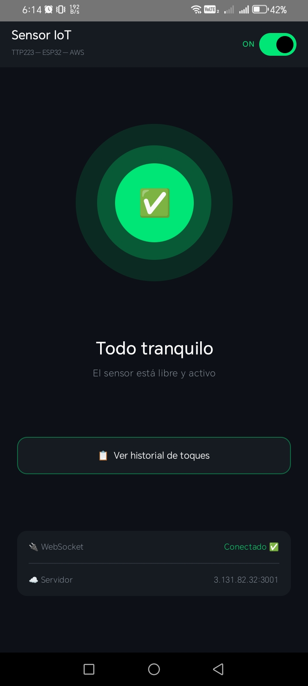

# SensorIoT — Aplicación Android

Aplicación Android nativa para monitoreo y control remoto en tiempo real del sensor táctil TTP223 vía WebSocket, como complemento móvil del sistema IoT desplegado en AWS EC2.



---

## :dart: Descripción

La app se conecta directamente al servidor WebSocket en AWS y permite:

- **Monitorear** el estado del sensor en tiempo real (HIGH / LOW / OFF)
- **Recibir notificaciones** con sonido y vibración cuando alguien toca el sensor, incluso con la pantalla apagada
- **Controlar** el sensor remotamente (encender / apagar) desde la app
- **Consultar el historial** de toques del día o de cualquier fecha anterior

Todo a través de una **única conexión WebSocket persistente** que se mantiene activa en segundo plano mediante un Foreground Service.

---

## ✨ Funcionalidades

- **Estado en tiempo real** — círculo animado con pulso en estado HIGH
- **Switch ON/OFF** — control remoto del sensor desde la barra superior
- **Notificación sonora** — `door.wav` al detectar toque, `warning.mp3` al apagarse
- **Vibración diferenciada** — patrón distinto por tipo de evento
- **Historial por fecha** — selector de calendario con total de toques del día
- **Sonido en primer plano** — reproduce el sonido directamente si la app está activa
- **Sin notificaciones redundantes** — las alertas se suprimen si la app está abierta
- **Reconexión automática** — reintenta cada 3 segundos ante pérdida de conexión
- **Modo oscuro** — interfaz dark nativa, cómoda para uso nocturno

---

## 🏗️ Arquitectura

```
WebSocketService (Foreground Service)
        │
        │  StateFlow
        ▼
SensorViewModel  ──────►  SensorScreen (Jetpack Compose)
        │
        │  HTTP (OkHttp)
        ▼
  API REST /api/reporte
```

### Componentes principales

| Archivo | Rol |
|---------|-----|
| `WebSocketService.kt` | Foreground Service — mantiene la conexión WebSocket activa en segundo plano y emite notificaciones |
| `SensorViewModel.kt` | ViewModel — gestiona el estado observable y consulta el historial vía REST |
| `SensorScreen.kt` | UI declarativa con Jetpack Compose — se actualiza reactivamente ante cambios de estado |
| `MainActivity.kt` | Punto de entrada — inicializa el servicio, solicita permisos y enlaza ViewModel con la UI |

---

## 📊 Estados del sensor

| Estado | Color | Ícono | Descripción |
|--------|-------|-------|-------------|
| `HIGH` | 🟡 Amarillo | 🚨 | Sensor siendo tocado |
| `LOW` | 🟢 Verde | ✅ | Sensor libre y activo |
| `OFF` | 🟠 Naranja | ⚠️ | Sensor desactivado remotamente |
| `DESCONECTADO` | ⚫ Gris | 📡 | Sin conexión al servidor |

---

## :bell: Canales de notificación

| Canal | Sonido | Vibración | Evento |
|-------|--------|-----------|--------|
| Toque de puerta | `door.wav` | Corta-pausa-corta | Sensor → HIGH |
| Sensor apagado | `warning.mp3` | Larga | Control → OFF |
| Sensor encendido | Sistema | — | Control → ON |
| Persistente | Sin sonido | — | Estado del servicio |

> Las notificaciones solo aparecen cuando la app está en **segundo plano**. Si está activa, el sonido se reproduce directamente.

---

## 🛠️ Stack tecnológico

| Capa | Tecnología |
|------|-----------|
| Lenguaje | Kotlin |
| UI | Jetpack Compose (Material 3) |
| Arquitectura | MVVM (ViewModel + StateFlow) |
| WebSocket | OkHttp 4.12.0 |
| Servicio en segundo plano | Foreground Service (dataSync) |
| Notificaciones | NotificationCompat — canales múltiples |
| Audio | MediaPlayer (sonidos personalizados) |
| API REST | HttpURLConnection |
| IDE | Android Studio Panda 3 \| 2025.3.3 |

---

## 📋 Requisitos

- Android **8.0 (API 26)** o superior
- Conexión a Internet (WiFi o datos móviles)
- El servidor WebSocket debe estar corriendo en `ws://3.131.82.32:3001` (definir en `util/Constants.kt`)

---

## :rocket: Instalación

### 1. Clonar e importar

```bash
git clone https://github.com/djcc2001/Sensor-Toque_IoT.git
```

Abre Android Studio → **File → Open** → selecciona la carpeta `Android/SensorIoT`.

### 2. Agregar los sonidos

Coloca tus archivos de audio en `app/src/main/res/raw/`:

```
res/raw/
├── door.wav       ← sonido al detectar toque
└── warning.mp3    ← sonido al apagarse el sensor
```

### 3. Configurar la IP del servidor

En `WebSocketService.kt`, ajusta la constante si cambias el servidor:

```kotlin
// IP centralizada en util/Constants.kt
```

### 4. Compilar y ejecutar

Conecta tu dispositivo Android con **Depuración USB** activada y presiona ▶️ en Android Studio.

### 5. Permisos en Honor/Huawei

Si usas un dispositivo Honor o Huawei, activa manualmente:

```
Ajustes → Batería → Inicio de aplicaciones → SensorIoT
→ Gestionar manualmente → Activar las 3 opciones
```

---

## :file_folder: Estructura del proyecto

```
SensorIoT/
├── app/src/main/
│   ├── java/com/embebidos/sensoriot/
│   │   ├── MainActivity.kt
│   │   ├── service/
│   │   │   └── WebSocketService.kt
│   │   ├── ui/
│   │   │   └── SensorScreen.kt
│   │   └── viewmodel/
│   │       └── SensorViewModel.kt
│   ├── res/
│   │   └── raw/
│   │       ├── door.wav
│   │       └── warning.mp3
│   └── AndroidManifest.xml
└── build.gradle.kts
```

---

## :link: Relacionado

- [Repositorio principal (ESP32 + Servidor)](https://github.com/djcc2001/Sensor-Toque_IoT)