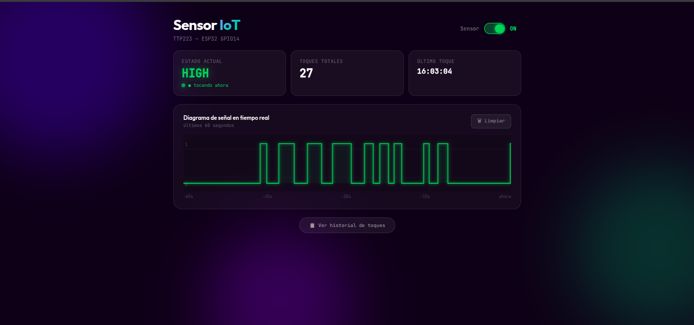
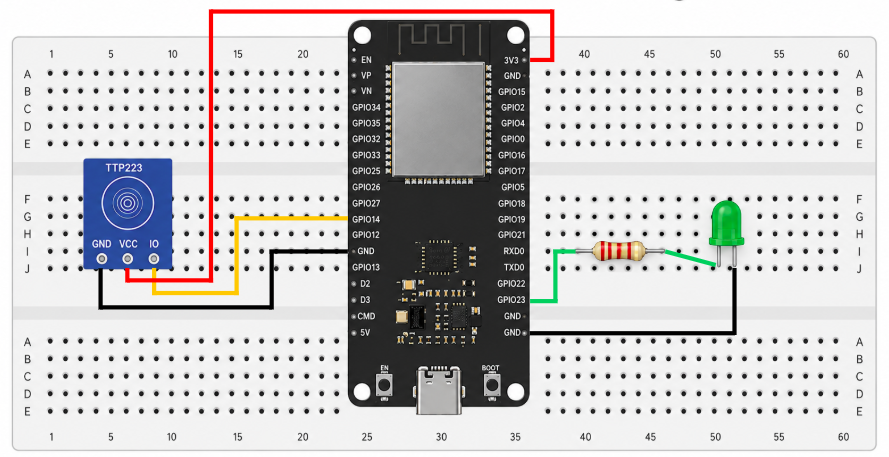
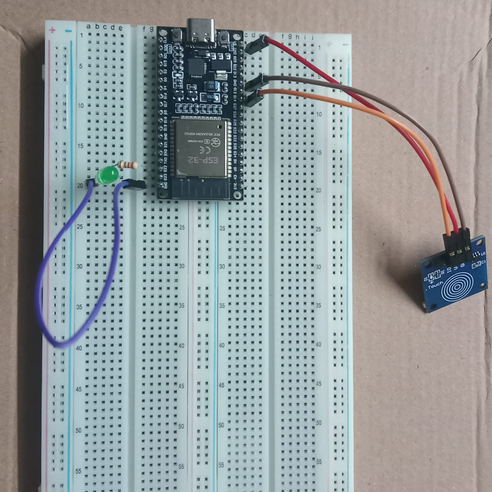

# 📡 Sensor IoT — Control Remoto desde AWS

Sistema IoT de monitoreo y control remoto en tiempo real de un sensor táctil capacitivo TTP223 con ESP32, comunicación WebSocket full-duplex y dashboard web desplegado en AWS EC2.



---

## 🎯 Descripción

El sistema permite comunicación **bidireccional completa**:
- El usuario toca el sensor físico → la señal aparece instantáneamente en el dashboard
- El usuario activa/desactiva el sensor desde el dashboard → el LED físico responde de inmediato
- Todo por una **única conexión WebSocket persistente** — sin HTTP polling, sin colas, sin latencia

---

## 📸 Capturas

| Dashboard | Circuito | Foto |
|----------|----------|------|
|  |  |  |

---

## 📐 Arquitectura

```
TTP223 → ESP32 ──WebSocket──► Node.js AWS ──WebSocket──► Dashboard
                ◄─────────────────────────────────────────
                    Comandos ON/OFF en tiempo real
```

### Flujo de comunicación

| Origen | Destino | Mensaje | Protocolo |
|--------|---------|---------|-----------|
| ESP32 | Servidor | `{"type":"touch","value":true}` | WebSocket |
| Dashboard | Servidor | `{"command":"on"\|"off"}` | WebSocket |
| Servidor | ESP32 | `{"command":"on"\|"off"}` | WebSocket |
| Servidor | Dashboard | `{"sensor":true/false, ...}` | WebSocket |

---

## 📁 Estructura del repositorio

```
Sensor_IoT/
├── ESP32_Sensor-Toque/       # Firmware ESP32
│   ├── src/
│   │   └── main.cpp
│   └── platformio.ini
├── Servidor/
│   ├── Servicio/             # Backend Node.js
│   │   ├── server.js
│   │   └── package.json
│   └── Frontend/             # Dashboard web
│       ├── index.html
│       ├── styles.css
│       └── app.js
├── imgs/
│   ├── dashboard.png
│   └── circuito.png
└── README.md
```

---

## ⚡ Características

- **WebSocket full-duplex** — una sola conexión persistente para todo
- **Control ON/OFF remoto** — LED físico responde instantáneamente
- **Gráfica event-driven** — dibuja solo cuando llega un evento real
- **Congelar/descongelar** — gráfica se pausa en gris al apagar
- **Debounce 80ms** — filtra rebotes del TTP223
- **Historial persistente** — toques guardados en disco por fecha
- **Reporte por fecha** — hora de inicio, fin, duración y hora pico
- **Reconexión automática** — ESP32 cada 3s, dashboard cada 3s
- **WiFi configurable** — portal web al primer arranque
- **Timestamps NTP** — logs con hora real sincronizada
- **LED indicador** — parpadea 3 veces al conectar WebSocket

---

## 🔌 Conexiones hardware

| TTP223 | ESP32 |
|--------|-------|
| GND | GND |
| VCC | 3.3V |
| IO | GPIO14 |

| LED indicador | ESP32 |
|---------------|-------|
| (+) Ánodo | GPIO23 via 220Ω |
| (-) Cátodo | GND |


---

## 🛠️ Tecnologías

| Capa | Tecnología |
|------|-----------|
| Hardware | ESP32 DevKit V1, TTP223, LED |
| Firmware | C++ / Arduino / FreeRTOS / PlatformIO |
| Protocolo | WebSocket (full-duplex) |
| Backend | Node.js, Express, ws |
| Frontend | HTML5, CSS3, JavaScript, Canvas API |
| Infraestructura | AWS EC2 Ubuntu, Apache, PM2 |
| Biblioteca WS | links2004/WebSockets (estable para ESP32) |
| Sincronización | NTP (pool.ntp.org) |

---

## 🚀 Inicio rápido

1. Clona el repositorio
2. Configura y sube el firmware → [ESP32 README](ESP32_Sensor-Toque/README.md)
3. Despliega el servidor → [Servidor README](Servidor/README.md)
4. Abre `http://TU_IP_AWS/sensor`

---

## 📊 API y WebSocket

| Tipo | Endpoint/Puerto | Descripción |
|------|----------------|-------------|
| WebSocket | `:3001` | Comunicación tiempo real |
| GET | `/api/estado` | Estado actual del sensor |
| GET | `/api/reporte?fecha=YYYY-MM-DD` | Reporte por fecha |
| GET | `/api/reporte/all` | Todas las fechas |

